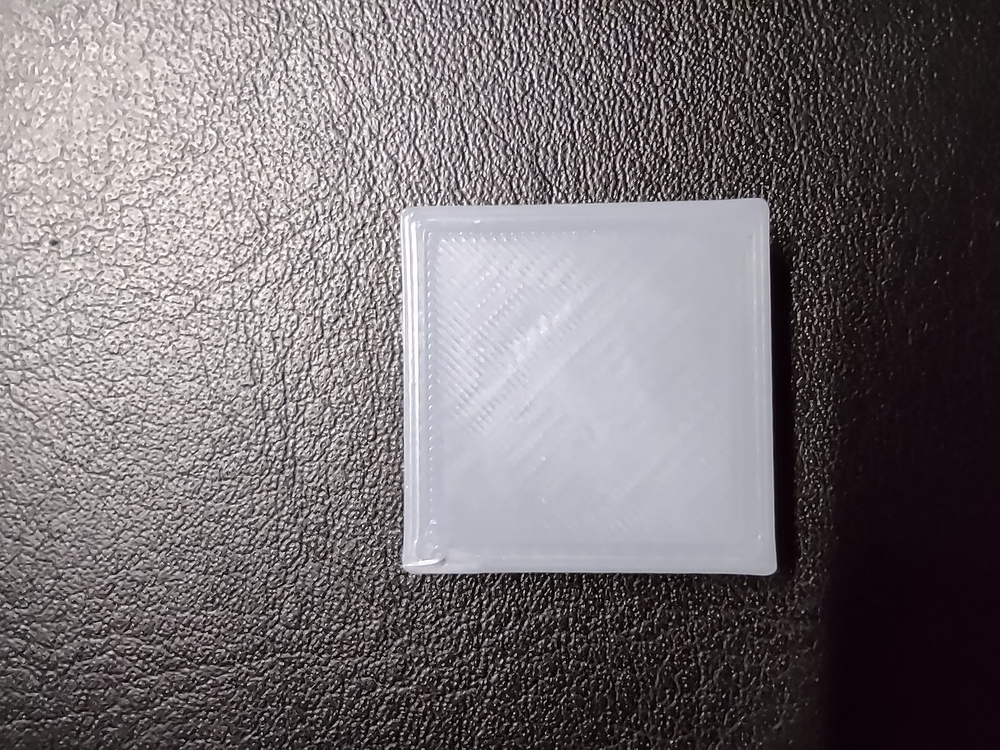
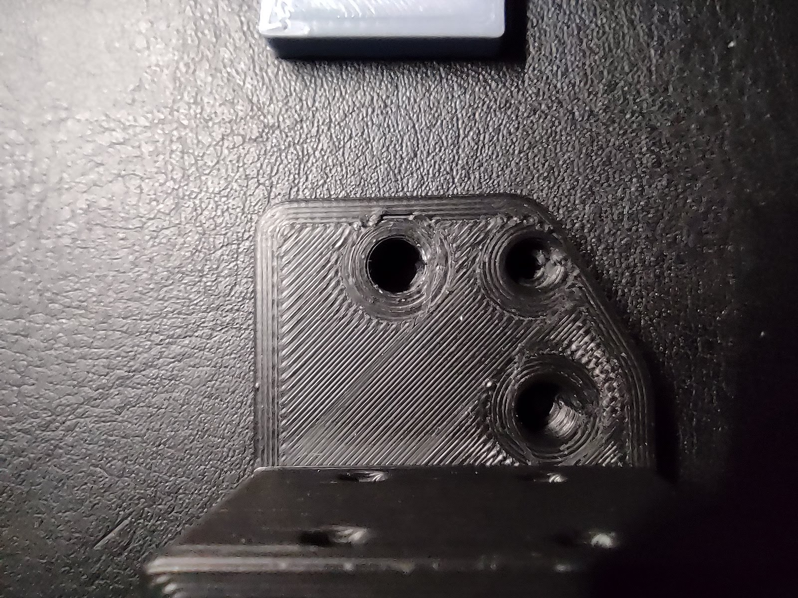
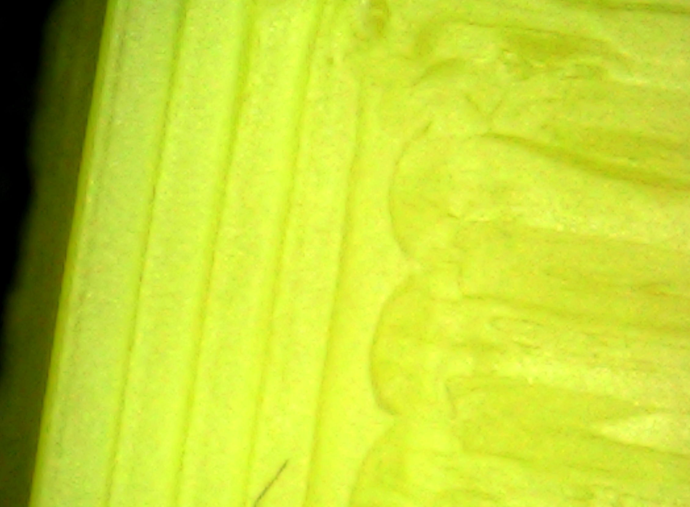

# Top Layers

For better top layers setup the following things.

## Top Surface Skin Line Width
Set this to 0.32mm when your normale line width is 0.4mm in order to get smoother
top surfaces. Using these settings no ironing is needed anymore.

Example with 0.2mm top surface line width:

Example with 0.32mm top surface line width:

## Skin overlap percentage
Put this to somewhere around 40% to get the following
result in which wall 5 is overlapped by the skin.

## Monotonic top surface
Set this to true to make the top even more smooth.